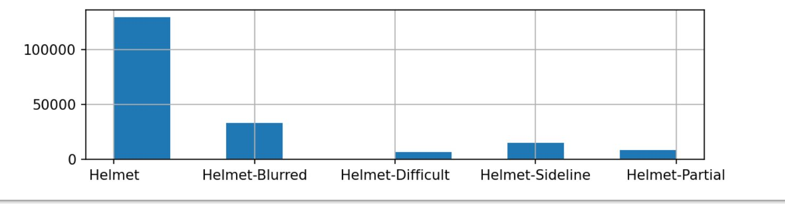
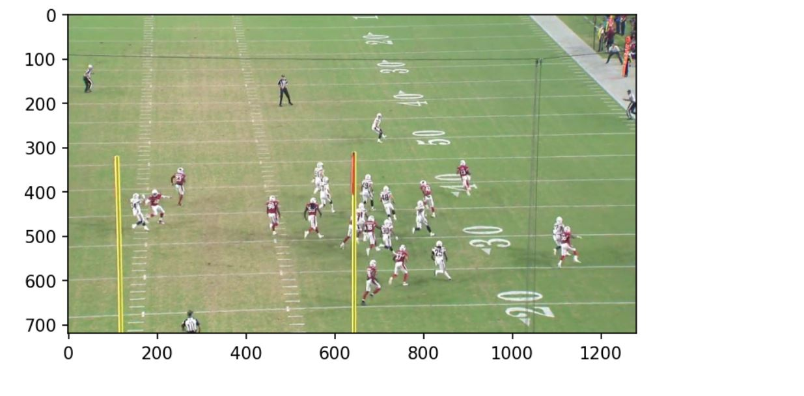
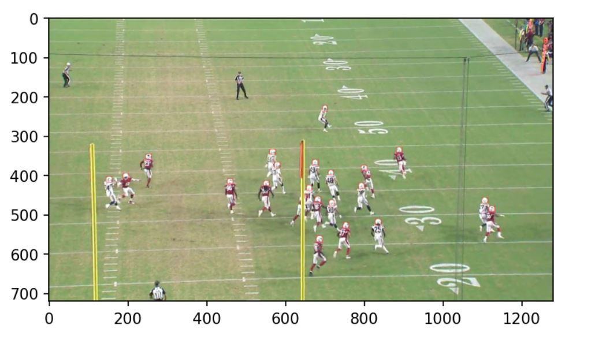

### NFL Helmet-to-Helmet Hits

## Abstract

The National Football League has long been criticized for the lack of safety of players' heads, specifically the end result of CTE, or chronic traumatic encephalopathy. CTE is a serious brain disease that is a result of repeated head traumas, something football players deal with on a weekly basis. The goal of this project is to develop a program that will accurately detect helmet-to-helmet contact between two players within a given video clip. The main problem for this project is to teach the computer to automatically detect whether a player was involved in head/helmet contact through NFL game footage. If a computer is able to automatically detect helmet contact 83 times faster than a person conducting the analysis manually, that would bridge the gap between the discontent of the safety enthusiast and the conservative football fan. With this information, we can further improve the detection of helmet-to-helmet contact in real time, and this may even assist with penalties to be called during the game and prevent more deaths related to CTE. Using computer vision and helmet bounding boxes supplied through the competition, our program is able to detect at what exact frame a helmet-to-helmet collision was made.

## Introduction

CTE, or Chronic traumatic encephalopathy, is a dangerous brain condition that develops due to continuous blows to the head. With new research and statistics being released yearly about this deadly condition, safety has become a topic of huge concern in the football community. One research that was conducted by Boston University found CTE in 99% of brains obtained from NFL players. For this project, we aim to teach the computer to automatically detect whether a player was involved in a helmet-to-helmet collision through NFL game footage. This topic is very interesting as it tries to make the most popular game in the States more safe for all parties involved. In the past couple of years, the NFL implemented new rules in order to protect the safety of players which have been dubbed as “soft” by critics and former players alike. This project is important because CTE is a very serious and destructive disease to the brain. CTE causes some detrimental outcomes, some being depression, memory loss, and eventually dementia. Sports, like football, where players are hitting each other in the head repeatedly need to become safer, so players do not need to suffer from these results anymore. Utilizing computer vision techniques and the data set supplied through the competition, our program is able to detect when and where a helmet-to-helmet collision occurs given a video clip and will then display a table with all the types of collisions seen in the video. Only head hits with a confidence greater than 1 and also have a visibility rating greater than 0, (are actually visibly a helmet-to-helmet hit), will be taken into consideration.

## Related Work

During these past couple of years, there have been a couple of approaches into developing systems that would be able to help detect helmet-to-helmet collision in no time. One of the approaches that has attracted the most attention has been the creation of sensors that would be implanted inside the player’s helmet and alert when such collisions occur. Researchers in Columbia were developing this kind of sensor which they called the “NoMo” and this device uses electroencephalography (EEG) sensors which are usually used in hospitals to measure a patient’s brain activity. Now, our approach differs from this one since we are using computer vision to try to solve this problem and only using video captures of the plays to detect when these collisions happen. That is to say, we are not getting involved in the game in the sense of modifying the equipment or any aspect of it, we are getting the info in when the players are involved so they can receive further assistance. This can be perceived better by critics and former players who are always skepticals about new rules and the evolving of the game. By taking this approach, we hope that the NFL will realize that a lot of helmet-to-helmet collisions occur on just single plays and that the safety of players needs to be taken more seriously.

## Data
As for the data we are working with, everything is provided by Kaggle. We have folders containing videos of plays, and each play consists of two videos, one with a sideline view and one with an endzone view. We also have a folder containing images of every frame of the videos. We also have csv files containing the specific information to create our detection system. This information consists of labels which indicates the location of the helmets as well as allowing us to track these helmets throughout the duration of the play and more importantly indicating us when there has been an helmet collision. This will be useful as this information will be used to train our model.

## Methods

(30%): Discuss your approach for solving the problems that you set up in the introduction. Why is your approach the right thing to do? Did you consider alternative approaches? You should demonstrate that you have applied ideas and skills built up during the quarter to tackling your problem of choice. It may be helpful to include figures, diagrams, or tables to describe your method or compare it with other methods.

First we took the helmet visibilty into question.

Since the main topic in this problem is about analyzing videos and determining specific events in them, our main concern is in the computer vision area and the best way to approach this problem is by using deep learning and convolutional neural networks (cnn) as they allow us to use images to detect and keep track of specific objects. As an initial step, we are using the built in cv2 library in python, as image processing becomes very simple. This will also help us to create the bounding boxes around the helmet of each player that would be used to track them throughout the play. The special thing about these bounding boxes is that they are not static, as their color will change to red when an impact is detected. So for this to get done, we will create a function that will take a video and use the train labels data to create such boxes. 

## Experiments

The experiments performed in this project were all video files supplied by the National Football League. Bounding boxes, as well as unique labels, were assigned to each player's helmet in it. After running the video, a table is displayed and shows each hit with a confidence level greater than one, and a visibility level greater than zero. This is so we know there was in fact a hit, and it is visible to the model. 

As you can see in the above table, the impact type is also displayed. The “label” column which is each player's unique helmet label based on their number and whether they are in the home or visiting team in the video and everyone displayed in this table was involved in some sort of impact. The areas we are focusing on are all the impact types with the “Helmet” label. The higher the confidence value, the more certain we are that the hit that occurred is accurately labeled with the correct impact type. The confidence column is distributed with numbers that indicate the different types of confidence levels. The number 1 indicates that an impact might exist, 2 is definitive, and 3 is definitive and obvious. In this one play alone, there were 8 helmet impact types of confidence level 2.0, and 11 helmet impact types of confidence 3.0, this shows us that our model is becoming secure when detecting these impacts. Other experiments conducted on this same problem This is very concerning for the players, as this will do serious damage to players' brains over a weekly game basis. 

## Conclusion

As we can see with the results, helmet-to-helmet hits are very common in the National Football league. From a technical standpoint, we learned that by using computer vision, we can pinpoint certain data points and use that to get the information we really need. In this case, we used computer vision to pinpoint the area around a players helmet, and whenever the players helmet came into contact with another players body part, whether it be shoulder, helmet, or body, that information is stored and displayed on the resulting table. For the future, maybe real time analysis can be applied. So as someone is watching a game, a model is also observing the game and looking at every hit that's taking place. This can be useful as to calling penalties in game and also fining players who partake in helmet-to-helmet hits frequently.

Submission: You will submit your final report as a markdown + img files under /docs in your Github repo, obviously together with your code and a README file that describes how anyone can run it to replicate your results. It is highly advised to author a Medium article about your work.
